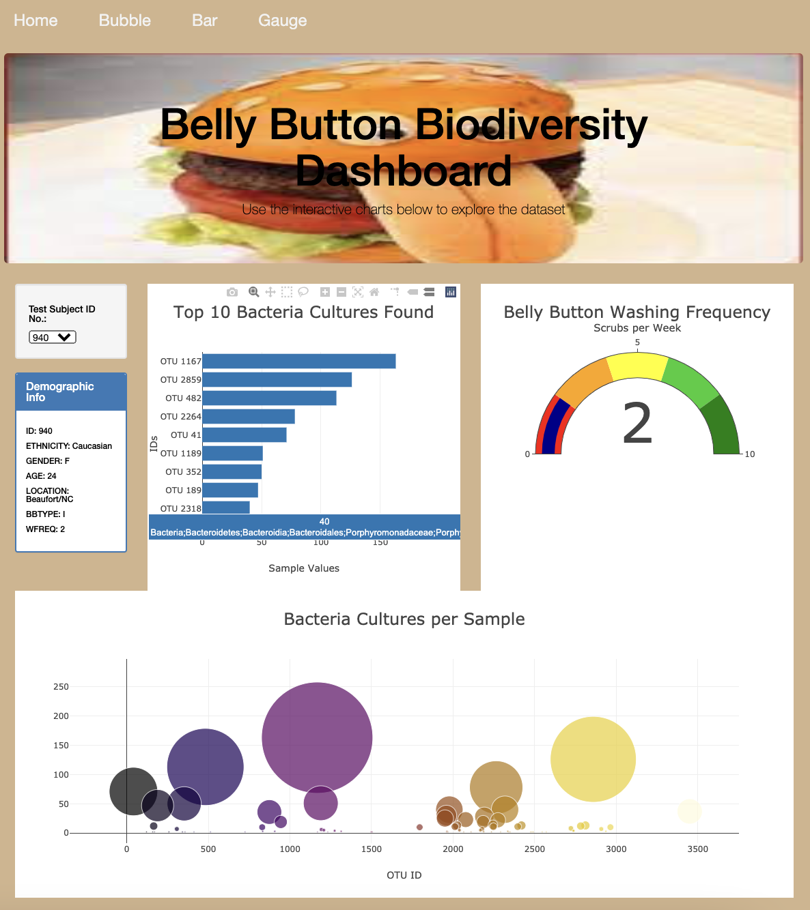
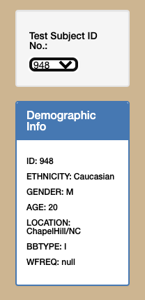
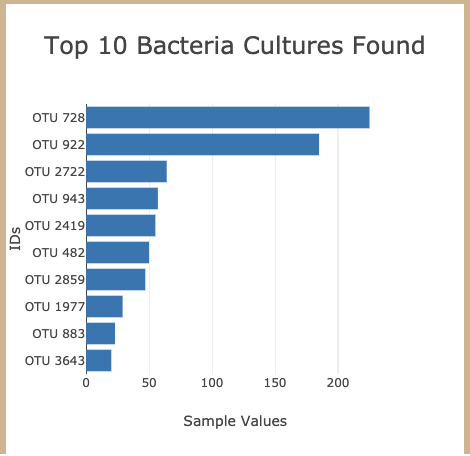
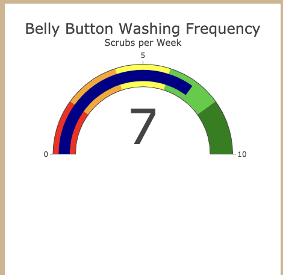
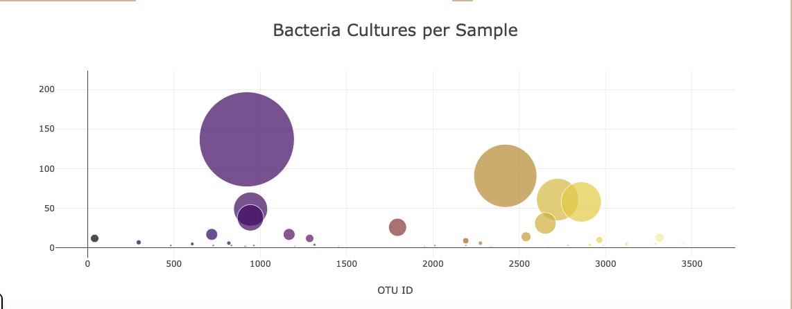

# Belly_Button_Burgers

## Overview
This project focuses on finding meat alternatives through bacteria found in human navels. Test subjects volunteered to have data collected about their washing habits as well as allowed bacteria specimens to be collected from their belly buttons.

## Results

Upon loading the website, the default data is displayed.

     

When the user accesses the website, all charts will preload with the first test subject in the list. There are four sources of data on the page.
1. Test Subject Metadata

    

2. Top 10 Bacteria

    

3. Washing Frequency

    
   
4. Bacteria Cultures

    
  

## Summary

A user can now look at the different samples collected by test subject and evaluate the usefulness of their bacteria.
